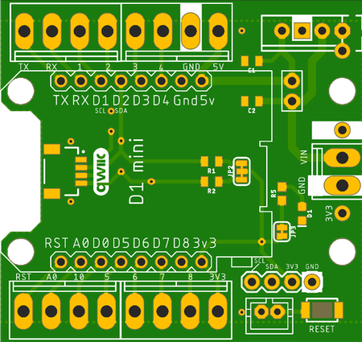
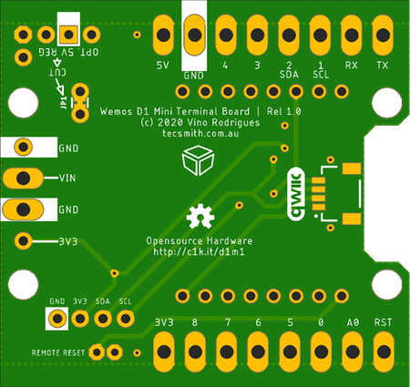

# Wemos / LOLIN D1 Mini Screw Terminal Breakout

**Wemos / LOLIN D1 Mini / Mini Pro Screw Terminal Breakout**, for mounting the [LOLIN D1 Mini](https://www.wemos.cc/en/latest/d1/d1_mini.html) board.

GitHub repository at [Tecsmith/arduino-wemos-d1-screw-terminal](https://github.com/Tecsmith/arduino-wemos-d1-screw-terminal/)

## Specifications

- Simple breakout in the Qwiic board form factor exposing D1 Mini pins to screw terminals
- 2x Qwiic connectors (works with SparkFun's [Qwiic Connect System](https://www.sparkfun.com/qwiic))
- Standard I2C breakout pins
- Reset button and remote reset button via JST-PH-2 header
- Optional 5V Voltage Regulator for use with higher voltages
  - It's recommended to use a [Pololu 5V Step-Up/-Down V-Regulator S10V4F5](https://www.pololu.com/product/2121)
  - Must CUT JP1 if Voltage Regulator is used!!

## On Board Jumpers

### JP1 - Optional 5V Voltage regulator (bottom)

Input voltage must abide by Wemos limit (ME6211 = 6V max), or you can solder in a 5V Voltage Regulator.

1. JP1 is by default TIED (shorting out V-Reg In and Out Pins).  This must be cut if the Voltage Regulator is installed.

2. One can also use the JP1 pins, with ties cut, as a remote ON/OFF switch (but with no Voltage Regulator).

### JP2 - I2C Pull Ups (top)

- Connected _(default)_: 4.7KΩ pullups
- Cut both sides: No pullups

### JP3 - LED Enable (top)

- Connected _(default)_: LED shows power state
- Cut: LED disabled

## Manufacturing

* Schematic print: [wemos-d1-screw-terminal-v1.0.pdf](wemos-d1-screw-terminal-v1.0.pdf)
* Schematic source (in EAGLE): [Tecsmith/arduino-wemos-d1-screw-terminal/EAGLE/wemos-d1-screw-terminal-v1.0.sch](https://github.com/Tecsmith/arduino-wemos-d1-screw-terminal/blob/main/EAGLE/wemos-d1-screw-terminal-v1.0.sch)
* PCB design (in EAGLE): [Tecsmith/arduino-wemos-d1-screw-terminal/EAGLE/wemos-d1-screw-terminal-v1.0.brd](https://github.com/Tecsmith/arduino-wemos-d1-screw-terminal/blob/main/EAGLE/wemos-d1-screw-terminal-v1.0.brd)

| Top | Bottom |
|:---:|:------:|
|  |  |

Initial prototype built by JCLPCB

----------

★

